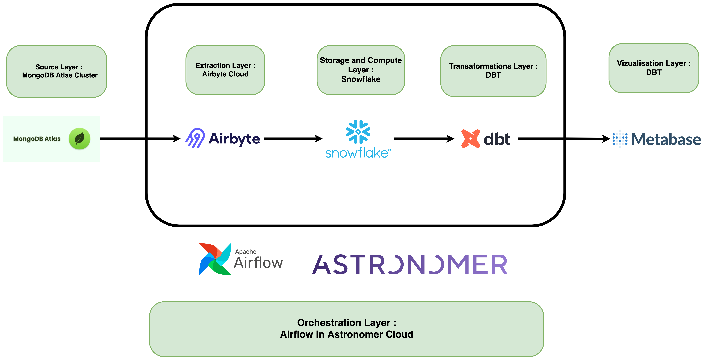
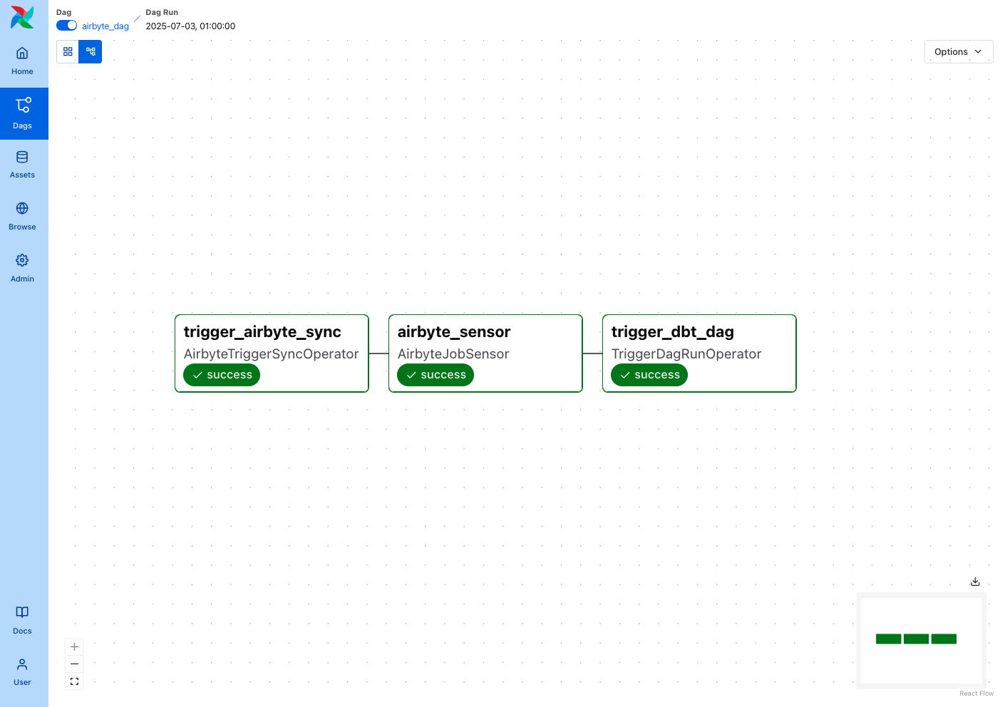
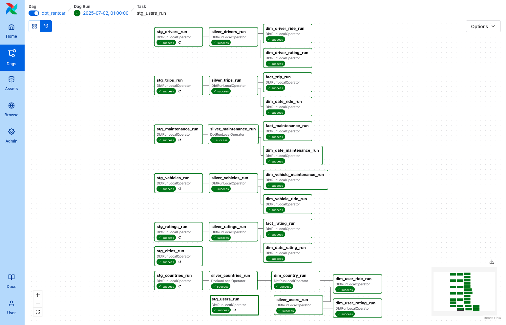
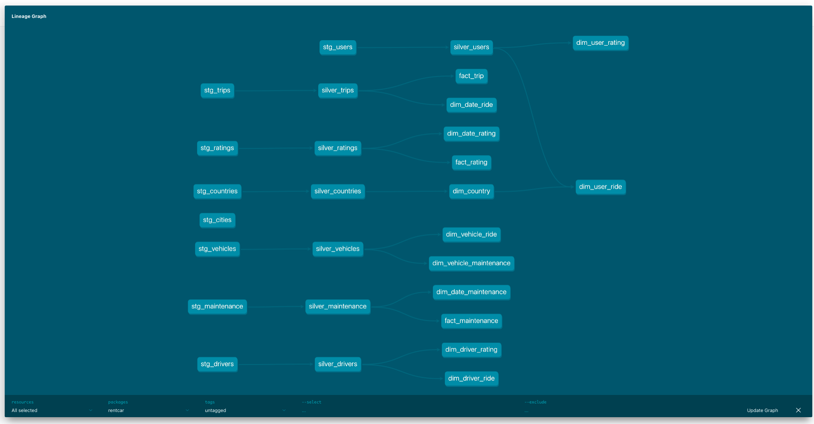
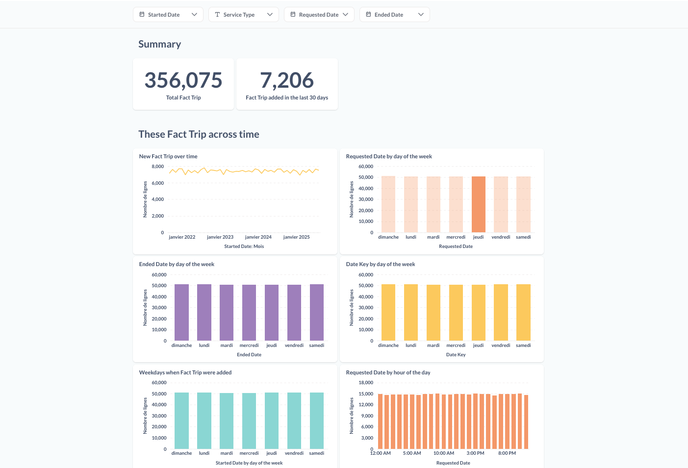
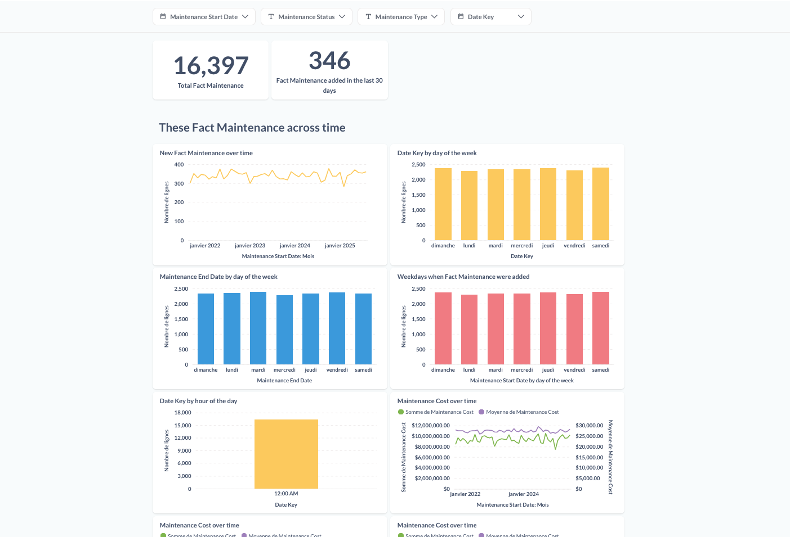
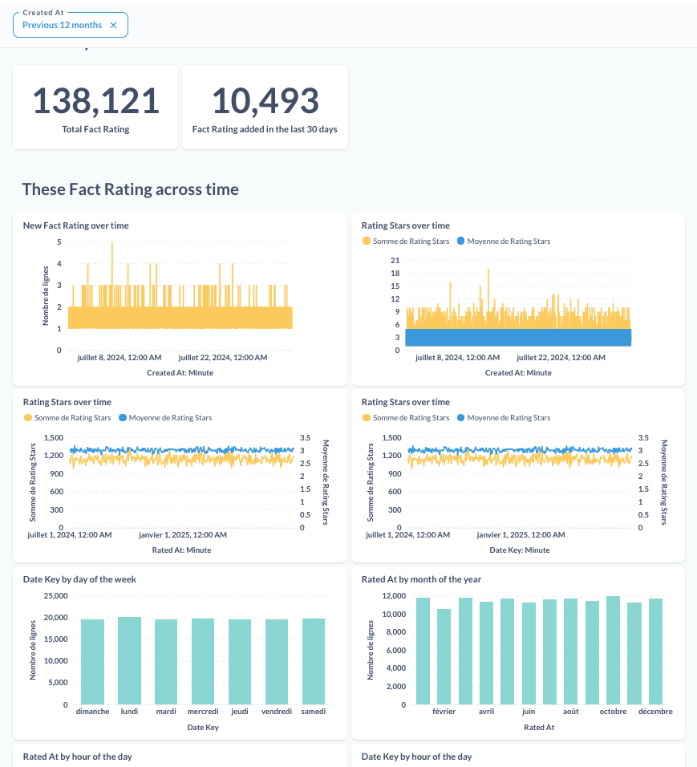

# 🎡 Mobility Data Platform — End‑to‑End Pipeline




1. 🏗️ **Architecture globale**  
2. ⚙️ **Composants & responsabilités**  
3. 🔄 **Orchestration Airflow**  
4. 📦 **dbt & Modélisation**  
5. 📊 Visualisation avec Metabase
6. 🤝 **Ressources & Contacts**


## 1. 🏗️ Architecture Globale


| Couche                | Outil / Service                   | Rôle                                                |
| --------------------- | --------------------------------- | --------------------------------------------------- |
| **Source**            | MongoDB Atlas                     | Base de données opérationnelle (Users, Trips, etc.) |
| **Extraction**        | Airbyte Cloud                     | Sync incrémental MongoDB → Snowflake                |
| **Storage & Compute** | Snowflake                         | Tables RAW, Silver, Marts                           |
| **Transformations**   | dbt                               | Staging ⭢ Silver ⭢ Marts (dim/fact par domaine)     |
| **Orchestration**     | Apache Airflow (Astronomer Cloud) | Scheduling, retries, alerting                       |
| **Visualisation**     | Metabase                          | Dashboards métiers (KPI, rapports)                  |


## 2. ⚙️ Composants & Responsabilités

| Composant              | Technologie          | Description                                                                     |
| ---------------------- | -------------------- | ------------------------------------------------------------------------------- |
| **Airbyte Connection** | Airbyte Cloud        | Sync configuré : MongoDB Atlas → Snowflake                                      |
| **DAGs Airflow**       | Astronomer / Airflow | 1. AirbyteTriggerSync<br>2. Attente (Sensor)<br>3. dbt run                    |
| **dbt Models**         | dbt (YAML + SQL)     | • staging/<br>• silver/<br>• marts/ride, rating, maintenance                   |
| **Tables Snowflake**   | Snowflake            | RAW\_\<table\>, SILVER\_\<table\>, MARTS\_DIM\_\*, MARTS\_FACT\_\*            |
| **Dashboards**         | Metabase             | Tableau de bord « Ride Analytics », « Rating Analytics », « Fleet Maintenance » |

## 3. 🔄 Orchestration Airflow

Nous orchestrons le pipeline avec **deux DAGs distincts** dans Airflow :

1. **`airbyte_dag`** – Charge les données depuis MongoDB Atlas vers Snowflake via Airbyte Cloud
2. **`dbt_dag`** – Exécute les modèles dbt une fois que le chargement est terminé


### 3.1. **DAG 1 : `airbyte_dag`**

👉 **Objectif** : lancer et monitorer la sync Airbyte Cloud

* **Schedule** : `@daily` (configurable)
* **Étapes** :

  1. **Trigger Airbyte**

     * Opérateur : `AirbyteTriggerSyncOperator`
     * Démarre la connexion MongoDB→Snowflake
  2. **Sensor Airbyte**

     * Opérateur : `AirbyteJobSensor`
     * Poll jusqu’à l’état `succeeded` ou `failed`
* **Alerting & Retries** : 2 tentatives, delay 5 min, timeout sensor 24 h


<summary>📷 Aperçu du `airbyte_dag`</summary>




### 3.2. **DAG 2 : `dbt_dag`**

👉 **Objectif** : transformer les tables RAW/SILVER en Marts analytiques

* **Déclenchement** :

  * Automatique via `TriggerDagRunOperator` à la fin de `airbyte_dag`
* **Schedule** : none (exécution uniquement par trigger)
* **Étapes** :

  1. **dbt deps & seed**
  2. **dbt run** (staging → silver → marts)
  3. **dbt test** (qualité des données, tests de schéma)
* **Logs & Monitoring** : visualisation des étapes dbt dans Airflow UI


<summary>📷 Aperçu du `dbt_dag`</summary>




### 3.3. **Flux global & dépendances**

```text
airbyte_dag                 dbt_dag
    ├─ trigger_airbyte      ──▶  (TriggerDagRunOperator)
    └─ airbyte_sensor           ──▶  dbt_dag.start
```

* **Étape 1** : `airbyte_dag` démarre à l’horaire planifié
* **Étape 2** : une fois la sync réussie, Airflow déclenche `dbt_dag`
* **Étape 3** : `dbt_dag` exécute définitivement toutes les transformations


## 4. 📦 dbt & Modélisation



### Structure

```text
models/
├── staging/      # raw → staging (incremental)
├── silver/       # staging → silver (nettoyage, dérivés)
└── marts/
    ├── ride_analytics/        # dim_*, fact_trip
    ├── rating_analytics/      # dim_*, fact_rating
    └── maintenance_analytics/ # dim_*, fact_maintenance
```

### Tables clés

| Layer   | Exemples de modèles               | Objectif                                       |
| ------- | --------------------------------- | ---------------------------------------------- |
| staging | `stg_users`, `stg_trips`, …       | Charger & découper les raw JSON Mongo          |
| silver  | `silver_users`, `silver_trips`, … | Nettoyage, formats, calculs (durée, age, etc.) |
| marts   | `dim_user`, `fact_trip`, …        | Modèles analytiques prêts à consommer (KPI)    |

### Data lineage


## 5. 📊 Visualisation avec Metabase

Nous utilisons **Metabase** pour explorer et partager nos insights via des tableaux de bord interactifs.  

| Fonctionnalité       | Description                                           |
|----------------------|-------------------------------------------------------|
| **Self‑service BI**  | Interface drag‑&‑drop pour requêtes ad hoc            |
| **Partage d’URLs**   | Publier des dashboards ou graphiques individuellement |
| **Alerting**         | Notifications programmées (email, Slack)              |

### Dashboards clés

1. **🚗 Ride Overview**  
   - Vue générale : nombre de courses, revenus et durée moyenne par jour/semaine  
   - Filtrage : par pays, type de service (ride, delivery, rental)  
   - Graphiques : timeseries, heatmap horaire  
   

2. **🔧 Maintenance Tracker**  
   - Suivi des coûts : coût total et moyen par véhicule et par mois  
   - Performances : temps moyen de réparation, nombre d’interventions  
   - Table détaillée : liste des pannes récentes avec lien vers le détail  
   

3. **⭐ Rating Overview**  
   - Avis positifs et négatifs : distribution, tendances temporelles  
   - Table détaillée : liste des commentaires récents avec lien vers le détail  
   


## 6. 🤝 Ressources & Contacts

| Ressource        | Lien                                                                                                                      |
| ---------------- | ------------------------------------------------------------------------------------------------------------------------- |
| 🐙 GitHub        | [https://github.com/abrahamkoloboe27](https://github.com/abrahamkoloboe27)                                                |
| 🔗 LinkedIn      | [https://www.linkedin.com/in/abraham-zacharie-koloboe-data](https://www.linkedin.com/in/abraham-zacharie-koloboe-data)... |
| 📖 dbt Docs      | [https://docs.getdbt.com](https://docs.getdbt.com)                                                                        |
| 🌐 Airbyte Cloud | [https://cloud.airbyte.com](https://cloud.airbyte.com)                                                                    |
| ❄️ Snowflake     | [https://www.snowflake.com](https://www.snowflake.com)                                                                    |
| 📊 Metabase      | [https://www.metabase.com](https://www.metabase.com)                                                                      |

> *Améliorez vos décisions grâce à un pipeline automatisé, fiable et extensible !* 🚀📈

